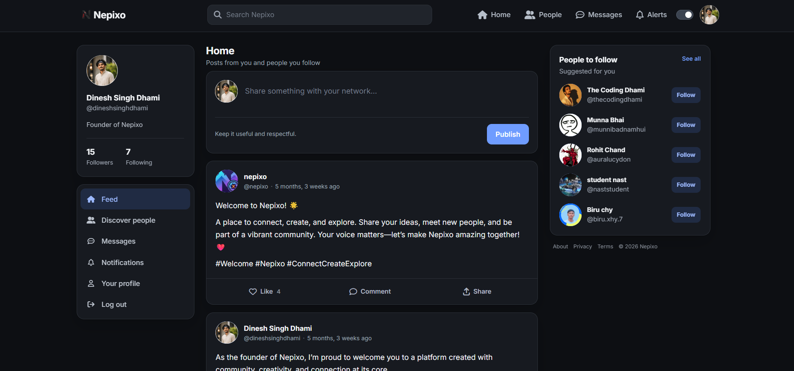

# # Nepixo


**Nepixo** is a simple **social media web application** built using **Django** and **SQLite**, allowing users to share posts, follow others, chat privately, and receive notifications through a clean and intuitive interface.

## # Project Background

During a period when social media platforms were temporarily restricted in Nepal, I created **Nepixo** as an independent web-based platform to stay connected and explore how social networking systems work from the ground up.

This project reflects both a practical solution to a real-world situation and my hands-on experience in building a full-featured social media application from scratch.

> **Note:** This project is **NOT open source**.  
> All source code, files, assets, and designs are proprietary and protected by copyright law. Unauthorized copying, modification, distribution, or reuse is strictly prohibited.

---

## # Screenshot

<p align="center">
  
</p>

---

## # Features

- Secure user authentication system
- User profiles with profile pictures
- Create, like, and comment on posts
- Follow and unfollow users
- Notification system (likes, comments, follows, messages)
- Private user-to-user messaging
- Media upload support
- Django admin panel for management
- Clean and responsive UI

---

## # Live Demo

**Website:** https://nepixo.pythonanywhere.com/

---

## # Tech Stack

- **Backend:** Django (Python)
- **Frontend:** HTML, CSS, Bootstrap
- **Database:** SQLite
- **Authentication:** Django Auth System
- **Real-time Support:** Django Channels (In-Memory Layer)
- **Forms:** django-crispy-forms
- **Deployment:** PythonAnywhere

---

## # Project Structure

```text
Nepixo/
├── core/
├── socialmedia/
├── media/
├── static/
│   └── images/
│       └── Dashboard.png
├── staticfiles/
├── templates/
├── manage.py
├── requirements.txt
└── README.md
```

---

## # License (Proprietary — All Rights Reserved)

This project is proprietary software. **All rights are reserved by the author.**

You are **NOT permitted** to:

- Copy or reproduce any part of the source code
- Modify or reuse any part of this project
- Redistribute, republish, or upload this project to any platform
- Use the source code, assets, or designs in personal, academic, or commercial projects
- Reverse-engineer, decompile, or create derivative works

> **⚠️ Unauthorized copying, modification, distribution, publication, or reuse of this project's source code, assets, or designs constitutes copyright infringement and may result in legal action, including claims for damages, injunctive relief, and any other remedies available under applicable copyright and intellectual property laws.**

No license or permission is granted to use this project without the **prior written consent** of the copyright owner.

For licensing inquiries or special permission, please contact the author directly.

The complete legal terms are available in the [LICENSE](LICENSE.md) file.

---

## # Contributions

External contributions are **not accepted**.

This project is privately owned and maintained solely by the author.

---

## # Author

**Dinesh Singh Dhami**  
🌐 **Website:** https://dineshsinghdhami.com.np  
💻 **GitHub:** https://github.com/dineshsinghdhami  
📧 **Email:** dineshdhamidn@gmail.com
